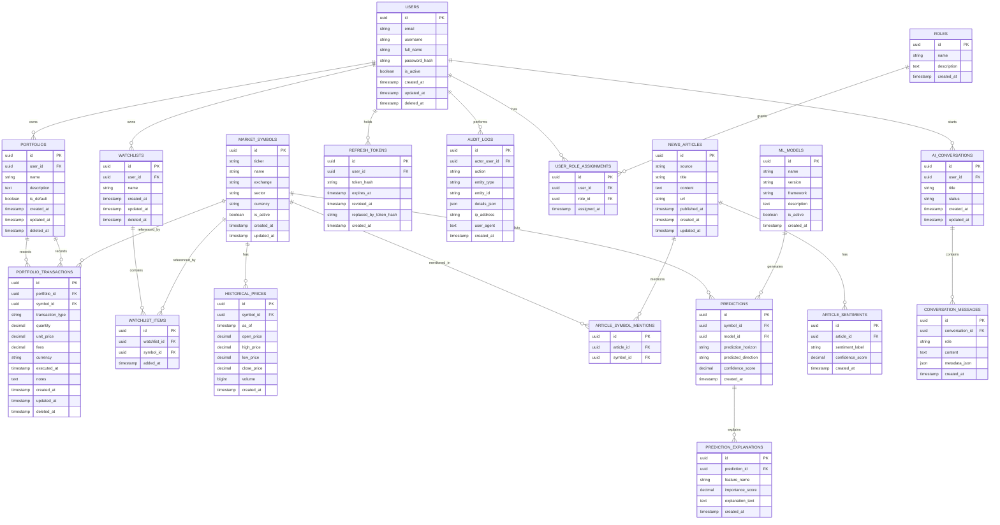

# FinSight AI PostgreSQL Data Model

## Overview

This document defines a production-ready PostgreSQL schema for FinSight AI. It preserves the existing modular monolith design while improving the data model for auditability, security, multi-entity analytics, and future AI capabilities.

## Architectural Decisions and Rationale

### 1. Transaction-based portfolio model

The previous portfolio holdings design stored a snapshot of current positions. That is convenient for display but weak for auditability and portfolio history. The new model stores every portfolio change as a transaction, which makes it possible to reconstruct positions, compute performance over time, and preserve a trustworthy ledger of buys, sells, dividends, and adjustments.

### 2. Multi-symbol news support

News articles often reference multiple companies or tickers at once. A single foreign key from news articles to a market symbol would be too restrictive. A junction table allows one article to be linked to many symbols without denormalizing the article itself.

### 3. ML models as first-class entities

Predictions should be traceable to the exact model that generated them. Introducing an ML models table ensures reproducibility, model-version tracking, and better governance for future experimentation.

### 4. AI conversations for future RAG capabilities

The schema anticipates future assistant experiences with conversational memory. Conversations and their messages are separated so the system can evolve to include retrieval, summarization, and long-running context windows without overloading the prediction or portfolio domain.

### 5. Refresh tokens for JWT lifecycle management

JWTs are stateless, so the system needs a server-side token record to support revocation, rotation, and secure logout workflows. Refresh tokens are stored hashed and linked to a user for safe lifecycle control.

### 6. Audit logs for security and traceability

Security-sensitive operations such as authentication events, role changes, portfolio edits, and token revocations should be recorded. The audit log table provides a central source of truth for investigations and compliance-oriented traceability.

### 7. Role-based access control instead of a single superuser flag

A single boolean flag is too coarse for enterprise-style authorization. The revised design uses a roles table plus a user-role assignment table so access control can be expanded to user, analyst, admin, and future domain-specific roles without schema churn.

### 8. HistoricalPrice instead of PriceSnapshot

The prior name implied a one-off capture. HistoricalPrice is more explicit for financial-domain data and aligns with the intent of storing time-series market history. This is a naming improvement only; the domain meaning is preserved.

### 9. Backward compatibility

The design keeps established concepts such as users, portfolios, watchlists, market symbols, news, predictions, and explanations intact. The main change is replacing the current holdings table with a more auditable transaction ledger and adding join tables where many-to-many relationships are required.

## Design Principles

- Use UUID primary keys for distributed-safe identity and easier future scaling.
- Store every mutable business event with timestamps.
- Prefer explicit relationship tables over denormalization.
- Use soft deletes where deletion should preserve auditability.
- Enforce business constraints in PostgreSQL where possible.
- Keep the schema ready for future AI retrieval and conversational features.

## Core Entities

- users
- roles
- user_role_assignments
- portfolios
- portfolio_transactions
- watchlists
- watchlist_items
- market_symbols
- historical_prices
- news_articles
- article_symbol_mentions
- article_sentiments
- ml_models
- predictions
- prediction_explanations
- ai_conversations
- conversation_messages
- refresh_tokens
- audit_logs

## UUID Strategy

All primary keys use UUIDs generated with `gen_random_uuid()` or application-side UUID generation. PostgreSQL `pgcrypto` support is assumed.

```sql
CREATE EXTENSION IF NOT EXISTS pgcrypto;
```

## SQLAlchemy ORM Models

```python
from __future__ import annotations

from datetime import datetime
from typing import Optional
from uuid import UUID, uuid4

from sqlalchemy import (
    Boolean,
    CheckConstraint,
    DateTime,
    ForeignKey,
    Index,
    JSON,
    Numeric,
    String,
    Text,
    UniqueConstraint,
    text,
)
from sqlalchemy.dialects.postgresql import UUID as PGUUID
from sqlalchemy.orm import DeclarativeBase, Mapped, mapped_column, relationship


class Base(DeclarativeBase):
    pass


class User(Base):
    __tablename__ = "users"

    id: Mapped[UUID] = mapped_column(PGUUID(as_uuid=True), primary_key=True, default=uuid4)
    email: Mapped[str] = mapped_column(String(255), unique=True, nullable=False, index=True)
    username: Mapped[str] = mapped_column(String(100), unique=True, nullable=False, index=True)
    full_name: Mapped[Optional[str]] = mapped_column(String(255), nullable=True)
    password_hash: Mapped[str] = mapped_column(String(255), nullable=False)
    is_active: Mapped[bool] = mapped_column(Boolean, nullable=False, server_default="true")
    created_at: Mapped[datetime] = mapped_column(DateTime(timezone=True), nullable=False, server_default=text("CURRENT_TIMESTAMP"))
    updated_at: Mapped[datetime] = mapped_column(DateTime(timezone=True), nullable=False, server_default=text("CURRENT_TIMESTAMP"), onupdate=text("CURRENT_TIMESTAMP"))
    deleted_at: Mapped[Optional[datetime]] = mapped_column(DateTime(timezone=True), nullable=True)

    portfolios: Mapped[list["Portfolio"]] = relationship(back_populates="owner", cascade="all, delete-orphan")
    watchlists: Mapped[list["Watchlist"]] = relationship(back_populates="owner", cascade="all, delete-orphan")
    refresh_tokens: Mapped[list["RefreshToken"]] = relationship(back_populates="user", cascade="all, delete-orphan")
    audit_logs: Mapped[list["AuditLog"]] = relationship(back_populates="actor")
    conversations: Mapped[list["Conversation"]] = relationship(back_populates="user", cascade="all, delete-orphan")
    role_assignments: Mapped[list["UserRoleAssignment"]] = relationship(back_populates="user", cascade="all, delete-orphan")


class Role(Base):
    __tablename__ = "roles"

    id: Mapped[UUID] = mapped_column(PGUUID(as_uuid=True), primary_key=True, default=uuid4)
    name: Mapped[str] = mapped_column(String(100), unique=True, nullable=False, index=True)
    description: Mapped[Optional[str]] = mapped_column(Text, nullable=True)
    created_at: Mapped[datetime] = mapped_column(DateTime(timezone=True), nullable=False, server_default=text("CURRENT_TIMESTAMP"))

    assignments: Mapped[list["UserRoleAssignment"]] = relationship(back_populates="role")


class UserRoleAssignment(Base):
    __tablename__ = "user_role_assignments"

    id: Mapped[UUID] = mapped_column(PGUUID(as_uuid=True), primary_key=True, default=uuid4)
    user_id: Mapped[UUID] = mapped_column(PGUUID(as_uuid=True), ForeignKey("users.id", ondelete="CASCADE"), nullable=False, index=True)
    role_id: Mapped[UUID] = mapped_column(PGUUID(as_uuid=True), ForeignKey("roles.id", ondelete="CASCADE"), nullable=False, index=True)
    assigned_at: Mapped[datetime] = mapped_column(DateTime(timezone=True), nullable=False, server_default=text("CURRENT_TIMESTAMP"))

    user: Mapped[User] = relationship(back_populates="role_assignments")
    role: Mapped[Role] = relationship(back_populates="assignments")

    __table_args__ = (
        UniqueConstraint("user_id", "role_id", name="uq_user_role_assignment"),
    )


class Portfolio(Base):
    __tablename__ = "portfolios"

    id: Mapped[UUID] = mapped_column(PGUUID(as_uuid=True), primary_key=True, default=uuid4)
    user_id: Mapped[UUID] = mapped_column(PGUUID(as_uuid=True), ForeignKey("users.id", ondelete="CASCADE"), nullable=False, index=True)
    name: Mapped[str] = mapped_column(String(255), nullable=False)
    description: Mapped[Optional[str]] = mapped_column(Text, nullable=True)
    is_default: Mapped[bool] = mapped_column(Boolean, nullable=False, server_default="false")
    created_at: Mapped[datetime] = mapped_column(DateTime(timezone=True), nullable=False, server_default=text("CURRENT_TIMESTAMP"))
    updated_at: Mapped[datetime] = mapped_column(DateTime(timezone=True), nullable=False, server_default=text("CURRENT_TIMESTAMP"), onupdate=text("CURRENT_TIMESTAMP"))
    deleted_at: Mapped[Optional[datetime]] = mapped_column(DateTime(timezone=True), nullable=True)

    owner: Mapped[User] = relationship(back_populates="portfolios")
    transactions: Mapped[list["PortfolioTransaction"]] = relationship(back_populates="portfolio", cascade="all, delete-orphan")

    __table_args__ = (
        UniqueConstraint("user_id", "name", "deleted_at", name="uq_portfolios_user_name_active"),
    )


class PortfolioTransaction(Base):
    __tablename__ = "portfolio_transactions"

    id: Mapped[UUID] = mapped_column(PGUUID(as_uuid=True), primary_key=True, default=uuid4)
    portfolio_id: Mapped[UUID] = mapped_column(PGUUID(as_uuid=True), ForeignKey("portfolios.id", ondelete="CASCADE"), nullable=False, index=True)
    symbol_id: Mapped[UUID] = mapped_column(PGUUID(as_uuid=True), ForeignKey("market_symbols.id", ondelete="RESTRICT"), nullable=False, index=True)
    transaction_type: Mapped[str] = mapped_column(String(20), nullable=False)
    quantity: Mapped[float] = mapped_column(Numeric(12, 6), nullable=False)
    unit_price: Mapped[float] = mapped_column(Numeric(12, 6), nullable=False)
    fees: Mapped[float] = mapped_column(Numeric(12, 6), nullable=False, server_default="0")
    currency: Mapped[str] = mapped_column(String(10), nullable=False, server_default="USD")
    executed_at: Mapped[datetime] = mapped_column(DateTime(timezone=True), nullable=False, index=True)
    notes: Mapped[Optional[str]] = mapped_column(Text, nullable=True)
    created_at: Mapped[datetime] = mapped_column(DateTime(timezone=True), nullable=False, server_default=text("CURRENT_TIMESTAMP"))
    updated_at: Mapped[datetime] = mapped_column(DateTime(timezone=True), nullable=False, server_default=text("CURRENT_TIMESTAMP"), onupdate=text("CURRENT_TIMESTAMP"))
    deleted_at: Mapped[Optional[datetime]] = mapped_column(DateTime(timezone=True), nullable=True)

    portfolio: Mapped[Portfolio] = relationship(back_populates="transactions")
    symbol: Mapped["MarketSymbol"] = relationship(back_populates="transactions")

    __table_args__ = (
        CheckConstraint("quantity <> 0", name="ck_portfolio_transactions_quantity_not_zero"),
        CheckConstraint("unit_price >= 0", name="ck_portfolio_transactions_unit_price_non_negative"),
        CheckConstraint("fees >= 0", name="ck_portfolio_transactions_fees_non_negative"),
    )


class Watchlist(Base):
    __tablename__ = "watchlists"

    id: Mapped[UUID] = mapped_column(PGUUID(as_uuid=True), primary_key=True, default=uuid4)
    user_id: Mapped[UUID] = mapped_column(PGUUID(as_uuid=True), ForeignKey("users.id", ondelete="CASCADE"), nullable=False, index=True)
    name: Mapped[str] = mapped_column(String(255), nullable=False)
    created_at: Mapped[datetime] = mapped_column(DateTime(timezone=True), nullable=False, server_default=text("CURRENT_TIMESTAMP"))
    updated_at: Mapped[datetime] = mapped_column(DateTime(timezone=True), nullable=False, server_default=text("CURRENT_TIMESTAMP"), onupdate=text("CURRENT_TIMESTAMP"))
    deleted_at: Mapped[Optional[datetime]] = mapped_column(DateTime(timezone=True), nullable=True)

    owner: Mapped[User] = relationship(back_populates="watchlists")
    items: Mapped[list["WatchlistItem"]] = relationship(back_populates="watchlist", cascade="all, delete-orphan")

    __table_args__ = (
        UniqueConstraint("user_id", "name", "deleted_at", name="uq_watchlists_user_name_active"),
    )


class WatchlistItem(Base):
    __tablename__ = "watchlist_items"

    id: Mapped[UUID] = mapped_column(PGUUID(as_uuid=True), primary_key=True, default=uuid4)
    watchlist_id: Mapped[UUID] = mapped_column(PGUUID(as_uuid=True), ForeignKey("watchlists.id", ondelete="CASCADE"), nullable=False, index=True)
    symbol_id: Mapped[UUID] = mapped_column(PGUUID(as_uuid=True), ForeignKey("market_symbols.id", ondelete="RESTRICT"), nullable=False, index=True)
    added_at: Mapped[datetime] = mapped_column(DateTime(timezone=True), nullable=False, server_default=text("CURRENT_TIMESTAMP"))

    watchlist: Mapped[Watchlist] = relationship(back_populates="items")
    symbol: Mapped["MarketSymbol"] = relationship(back_populates="watchlist_items")

    __table_args__ = (
        UniqueConstraint("watchlist_id", "symbol_id", name="uq_watchlist_items_watchlist_symbol"),
    )


class MarketSymbol(Base):
    __tablename__ = "market_symbols"

    id: Mapped[UUID] = mapped_column(PGUUID(as_uuid=True), primary_key=True, default=uuid4)
    ticker: Mapped[str] = mapped_column(String(20), unique=True, nullable=False, index=True)
    name: Mapped[str] = mapped_column(String(255), nullable=False)
    exchange: Mapped[Optional[str]] = mapped_column(String(100), nullable=True)
    sector: Mapped[Optional[str]] = mapped_column(String(100), nullable=True)
    currency: Mapped[str] = mapped_column(String(10), nullable=False, server_default="USD")
    is_active: Mapped[bool] = mapped_column(Boolean, nullable=False, server_default="true")
    created_at: Mapped[datetime] = mapped_column(DateTime(timezone=True), nullable=False, server_default=text("CURRENT_TIMESTAMP"))
    updated_at: Mapped[datetime] = mapped_column(DateTime(timezone=True), nullable=False, server_default=text("CURRENT_TIMESTAMP"), onupdate=text("CURRENT_TIMESTAMP"))

    transactions: Mapped[list[PortfolioTransaction]] = relationship(back_populates="symbol")
    watchlist_items: Mapped[list[WatchlistItem]] = relationship(back_populates="symbol")
    historical_prices: Mapped[list["HistoricalPrice"]] = relationship(back_populates="symbol")
    article_mentions: Mapped[list["ArticleSymbolMention"]] = relationship(back_populates="symbol")
    predictions: Mapped[list["Prediction"]] = relationship(back_populates="symbol")


class HistoricalPrice(Base):
    __tablename__ = "historical_prices"

    id: Mapped[UUID] = mapped_column(PGUUID(as_uuid=True), primary_key=True, default=uuid4)
    symbol_id: Mapped[UUID] = mapped_column(PGUUID(as_uuid=True), ForeignKey("market_symbols.id", ondelete="CASCADE"), nullable=False, index=True)
    as_of: Mapped[datetime] = mapped_column(DateTime(timezone=True), nullable=False, index=True)
    open_price: Mapped[float] = mapped_column(Numeric(12, 4), nullable=False)
    high_price: Mapped[float] = mapped_column(Numeric(12, 4), nullable=False)
    low_price: Mapped[float] = mapped_column(Numeric(12, 4), nullable=False)
    close_price: Mapped[float] = mapped_column(Numeric(12, 4), nullable=False)
    volume: Mapped[int] = mapped_column(Numeric(20, 0), nullable=False)
    created_at: Mapped[datetime] = mapped_column(DateTime(timezone=True), nullable=False, server_default=text("CURRENT_TIMESTAMP"))

    symbol: Mapped[MarketSymbol] = relationship(back_populates="historical_prices")

    __table_args__ = (
        UniqueConstraint("symbol_id", "as_of", name="uq_historical_prices_symbol_asof"),
    )


class NewsArticle(Base):
    __tablename__ = "news_articles"

    id: Mapped[UUID] = mapped_column(PGUUID(as_uuid=True), primary_key=True, default=uuid4)
    source: Mapped[str] = mapped_column(String(255), nullable=False)
    title: Mapped[str] = mapped_column(String(500), nullable=False)
    content: Mapped[Optional[str]] = mapped_column(Text, nullable=True)
    url: Mapped[Optional[str]] = mapped_column(String(2048), nullable=True)
    published_at: Mapped[datetime] = mapped_column(DateTime(timezone=True), nullable=False, index=True)
    created_at: Mapped[datetime] = mapped_column(DateTime(timezone=True), nullable=False, server_default=text("CURRENT_TIMESTAMP"))
    updated_at: Mapped[datetime] = mapped_column(DateTime(timezone=True), nullable=False, server_default=text("CURRENT_TIMESTAMP"), onupdate=text("CURRENT_TIMESTAMP"))

    symbol_mentions: Mapped[list["ArticleSymbolMention"]] = relationship(back_populates="article", cascade="all, delete-orphan")
    sentiments: Mapped[list["ArticleSentiment"]] = relationship(back_populates="article", cascade="all, delete-orphan")


class ArticleSymbolMention(Base):
    __tablename__ = "article_symbol_mentions"

    id: Mapped[UUID] = mapped_column(PGUUID(as_uuid=True), primary_key=True, default=uuid4)
    article_id: Mapped[UUID] = mapped_column(PGUUID(as_uuid=True), ForeignKey("news_articles.id", ondelete="CASCADE"), nullable=False, index=True)
    symbol_id: Mapped[UUID] = mapped_column(PGUUID(as_uuid=True), ForeignKey("market_symbols.id", ondelete="RESTRICT"), nullable=False, index=True)

    article: Mapped[NewsArticle] = relationship(back_populates="symbol_mentions")
    symbol: Mapped[MarketSymbol] = relationship(back_populates="article_mentions")

    __table_args__ = (
        UniqueConstraint("article_id", "symbol_id", name="uq_article_symbol_mention"),
    )


class ArticleSentiment(Base):
    __tablename__ = "article_sentiments"

    id: Mapped[UUID] = mapped_column(PGUUID(as_uuid=True), primary_key=True, default=uuid4)
    article_id: Mapped[UUID] = mapped_column(PGUUID(as_uuid=True), ForeignKey("news_articles.id", ondelete="CASCADE"), nullable=False, index=True)
    sentiment_label: Mapped[str] = mapped_column(String(20), nullable=False)
    confidence_score: Mapped[float] = mapped_column(Numeric(4, 3), nullable=False)
    created_at: Mapped[datetime] = mapped_column(DateTime(timezone=True), nullable=False, server_default=text("CURRENT_TIMESTAMP"))

    article: Mapped[NewsArticle] = relationship(back_populates="sentiments")


class MLModel(Base):
    __tablename__ = "ml_models"

    id: Mapped[UUID] = mapped_column(PGUUID(as_uuid=True), primary_key=True, default=uuid4)
    name: Mapped[str] = mapped_column(String(255), nullable=False)
    version: Mapped[str] = mapped_column(String(100), nullable=False)
    framework: Mapped[Optional[str]] = mapped_column(String(100), nullable=True)
    description: Mapped[Optional[str]] = mapped_column(Text, nullable=True)
    is_active: Mapped[bool] = mapped_column(Boolean, nullable=False, server_default="true")
    created_at: Mapped[datetime] = mapped_column(DateTime(timezone=True), nullable=False, server_default=text("CURRENT_TIMESTAMP"))

    predictions: Mapped[list["Prediction"]] = relationship(back_populates="model")


class Prediction(Base):
    __tablename__ = "predictions"

    id: Mapped[UUID] = mapped_column(PGUUID(as_uuid=True), primary_key=True, default=uuid4)
    symbol_id: Mapped[UUID] = mapped_column(PGUUID(as_uuid=True), ForeignKey("market_symbols.id", ondelete="CASCADE"), nullable=False, index=True)
    model_id: Mapped[UUID] = mapped_column(PGUUID(as_uuid=True), ForeignKey("ml_models.id", ondelete="RESTRICT"), nullable=False, index=True)
    prediction_horizon: Mapped[str] = mapped_column(String(50), nullable=False)
    predicted_direction: Mapped[str] = mapped_column(String(20), nullable=False)
    confidence_score: Mapped[float] = mapped_column(Numeric(4, 3), nullable=False)
    created_at: Mapped[datetime] = mapped_column(DateTime(timezone=True), nullable=False, server_default=text("CURRENT_TIMESTAMP"))

    symbol: Mapped[MarketSymbol] = relationship(back_populates="predictions")
    model: Mapped[MLModel] = relationship(back_populates="predictions")
    explanations: Mapped[list["PredictionExplanation"]] = relationship(back_populates="prediction", cascade="all, delete-orphan")


class PredictionExplanation(Base):
    __tablename__ = "prediction_explanations"

    id: Mapped[UUID] = mapped_column(PGUUID(as_uuid=True), primary_key=True, default=uuid4)
    prediction_id: Mapped[UUID] = mapped_column(PGUUID(as_uuid=True), ForeignKey("predictions.id", ondelete="CASCADE"), nullable=False, index=True)
    feature_name: Mapped[str] = mapped_column(String(255), nullable=False)
    importance_score: Mapped[float] = mapped_column(Numeric(8, 6), nullable=False)
    explanation_text: Mapped[Optional[str]] = mapped_column(Text, nullable=True)
    created_at: Mapped[datetime] = mapped_column(DateTime(timezone=True), nullable=False, server_default=text("CURRENT_TIMESTAMP"))

    prediction: Mapped[Prediction] = relationship(back_populates="explanations")


class Conversation(Base):
    __tablename__ = "ai_conversations"

    id: Mapped[UUID] = mapped_column(PGUUID(as_uuid=True), primary_key=True, default=uuid4)
    user_id: Mapped[UUID] = mapped_column(PGUUID(as_uuid=True), ForeignKey("users.id", ondelete="CASCADE"), nullable=False, index=True)
    title: Mapped[Optional[str]] = mapped_column(String(255), nullable=True)
    status: Mapped[str] = mapped_column(String(30), nullable=False, server_default="active")
    created_at: Mapped[datetime] = mapped_column(DateTime(timezone=True), nullable=False, server_default=text("CURRENT_TIMESTAMP"))
    updated_at: Mapped[datetime] = mapped_column(DateTime(timezone=True), nullable=False, server_default=text("CURRENT_TIMESTAMP"), onupdate=text("CURRENT_TIMESTAMP"))

    user: Mapped[User] = relationship(back_populates="conversations")
    messages: Mapped[list["ConversationMessage"]] = relationship(back_populates="conversation", cascade="all, delete-orphan")


class ConversationMessage(Base):
    __tablename__ = "conversation_messages"

    id: Mapped[UUID] = mapped_column(PGUUID(as_uuid=True), primary_key=True, default=uuid4)
    conversation_id: Mapped[UUID] = mapped_column(PGUUID(as_uuid=True), ForeignKey("ai_conversations.id", ondelete="CASCADE"), nullable=False, index=True)
    role: Mapped[str] = mapped_column(String(20), nullable=False)
    content: Mapped[str] = mapped_column(Text, nullable=False)
    metadata_json: Mapped[Optional[dict]] = mapped_column(JSON, nullable=True)
    created_at: Mapped[datetime] = mapped_column(DateTime(timezone=True), nullable=False, server_default=text("CURRENT_TIMESTAMP"))

    conversation: Mapped[Conversation] = relationship(back_populates="messages")


class RefreshToken(Base):
    __tablename__ = "refresh_tokens"

    id: Mapped[UUID] = mapped_column(PGUUID(as_uuid=True), primary_key=True, default=uuid4)
    user_id: Mapped[UUID] = mapped_column(PGUUID(as_uuid=True), ForeignKey("users.id", ondelete="CASCADE"), nullable=False, index=True)
    token_hash: Mapped[str] = mapped_column(String(255), unique=True, nullable=False, index=True)
    expires_at: Mapped[datetime] = mapped_column(DateTime(timezone=True), nullable=False, index=True)
    revoked_at: Mapped[Optional[datetime]] = mapped_column(DateTime(timezone=True), nullable=True)
    replaced_by_token_hash: Mapped[Optional[str]] = mapped_column(String(255), nullable=True)
    created_at: Mapped[datetime] = mapped_column(DateTime(timezone=True), nullable=False, server_default=text("CURRENT_TIMESTAMP"))

    user: Mapped[User] = relationship(back_populates="refresh_tokens")


class AuditLog(Base):
    __tablename__ = "audit_logs"

    id: Mapped[UUID] = mapped_column(PGUUID(as_uuid=True), primary_key=True, default=uuid4)
    actor_user_id: Mapped[Optional[UUID]] = mapped_column(PGUUID(as_uuid=True), ForeignKey("users.id", ondelete="SET NULL"), nullable=True, index=True)
    action: Mapped[str] = mapped_column(String(100), nullable=False, index=True)
    entity_type: Mapped[str] = mapped_column(String(100), nullable=False, index=True)
    entity_id: Mapped[Optional[str]] = mapped_column(String(255), nullable=True, index=True)
    details_json: Mapped[Optional[dict]] = mapped_column(JSON, nullable=True)
    ip_address: Mapped[Optional[str]] = mapped_column(String(45), nullable=True)
    user_agent: Mapped[Optional[str]] = mapped_column(Text, nullable=True)
    created_at: Mapped[datetime] = mapped_column(DateTime(timezone=True), nullable=False, server_default=text("CURRENT_TIMESTAMP"))

    actor: Mapped[Optional[User]] = relationship(back_populates="audit_logs")
```

## Mermaid ER Diagram



## Constraints

- Primary keys: all UUID-based.
- Foreign keys:
  - portfolios.user_id -> users.id
  - portfolio_transactions.portfolio_id -> portfolios.id
  - portfolio_transactions.symbol_id -> market_symbols.id
  - watchlists.user_id -> users.id
  - watchlist_items.watchlist_id -> watchlists.id
  - watchlist_items.symbol_id -> market_symbols.id
  - historical_prices.symbol_id -> market_symbols.id
  - article_symbol_mentions.article_id -> news_articles.id
  - article_symbol_mentions.symbol_id -> market_symbols.id
  - article_sentiments.article_id -> news_articles.id
  - predictions.symbol_id -> market_symbols.id
  - predictions.model_id -> ml_models.id
  - prediction_explanations.prediction_id -> predictions.id
  - ai_conversations.user_id -> users.id
  - conversation_messages.conversation_id -> ai_conversations.id
  - refresh_tokens.user_id -> users.id
  - audit_logs.actor_user_id -> users.id
- Uniqueness:
  - users.email unique
  - users.username unique
  - roles.name unique
  - user_role_assignments user/role unique
  - portfolios user/name combination unique while active
  - watchlists user/name combination unique while active
  - watchlist_items watchlist/symbol unique
  - article_symbol_mentions article/symbol unique
  - historical_prices symbol/as_of unique
- Checks:
  - portfolio_transactions.quantity != 0
  - portfolio_transactions.unit_price >= 0
  - portfolio_transactions.fees >= 0
  - confidence_score between 0 and 1
  - sentiment_label in (bullish, neutral, bearish)
  - predicted_direction in (up, down, neutral)
  - conversation message role in (user, assistant, system)

## PostgreSQL Indexes

```sql
CREATE INDEX idx_users_email ON users (email);
CREATE INDEX idx_users_username ON users (username);
CREATE INDEX idx_portfolios_user_id ON portfolios (user_id);
CREATE INDEX idx_portfolios_name ON portfolios (name);
CREATE INDEX idx_portfolio_transactions_portfolio_id ON portfolio_transactions (portfolio_id, executed_at DESC);
CREATE INDEX idx_portfolio_transactions_symbol_id ON portfolio_transactions (symbol_id, executed_at DESC);
CREATE INDEX idx_watchlists_user_id ON watchlists (user_id);
CREATE INDEX idx_watchlist_items_watchlist_id ON watchlist_items (watchlist_id);
CREATE INDEX idx_watchlist_items_symbol_id ON watchlist_items (symbol_id);
CREATE INDEX idx_market_symbols_ticker ON market_symbols (ticker);
CREATE INDEX idx_historical_prices_symbol_asof ON historical_prices (symbol_id, as_of DESC);
CREATE INDEX idx_news_articles_published_at ON news_articles (published_at DESC);
CREATE INDEX idx_article_symbol_mentions_symbol_id ON article_symbol_mentions (symbol_id);
CREATE INDEX idx_article_sentiments_article_id ON article_sentiments (article_id);
CREATE INDEX idx_predictions_symbol_model ON predictions (symbol_id, model_id, created_at DESC);
CREATE INDEX idx_prediction_explanations_prediction_id ON prediction_explanations (prediction_id);
CREATE INDEX idx_ai_conversations_user_id ON ai_conversations (user_id, updated_at DESC);
CREATE INDEX idx_conversation_messages_conversation_id ON conversation_messages (conversation_id, created_at DESC);
CREATE INDEX idx_refresh_tokens_user_id ON refresh_tokens (user_id, expires_at);
CREATE INDEX idx_audit_logs_actor_created_at ON audit_logs (actor_user_id, created_at DESC);
CREATE INDEX idx_audit_logs_entity ON audit_logs (entity_type, entity_id);
```

## Relationship Explanation

- A user owns portfolios and watchlists, may have many roles, and can start multiple AI conversations.
- A portfolio contains many transactions rather than current-position snapshots; this preserves transaction history and makes performance calculations accurate.
- Each portfolio transaction references one market symbol, enabling portfolio-level performance over time.
- A watchlist contains many symbols, and each symbol can appear in many watchlists.
- Market symbols are anchored to historical prices, watchlist items, portfolio transactions, and prediction outputs.
- News articles can mention many symbols through the article_symbol_mentions junction table, avoiding the limitations of a single-symbol foreign key.
- Predictions are generated by a specific ML model and are linked to one market symbol.
- AI conversations are user-owned and contain ordered messages that can later support retrieval-augmented generation.
- Refresh tokens are linked to users to support token revocation and rotation.
- Audit logs capture operational actions across the platform for security and traceability.

## Migration Notes

1. Create the `pgcrypto` extension.
2. Create the `roles` table.
3. Create the `users` table.
4. Create the `user_role_assignments` table.
5. Create the `market_symbols` table.
6. Create the `portfolios` and `portfolio_transactions` tables.
7. Create the `watchlists` and `watchlist_items` tables.
8. Create the `historical_prices` table.
9. Create the `news_articles`, `article_symbol_mentions`, and `article_sentiments` tables.
10. Create the `ml_models`, `predictions`, and `prediction_explanations` tables.
11. Create the `ai_conversations`, `conversation_messages`, `refresh_tokens`, and `audit_logs` tables.
12. Add all indexes and constraints in the same migration set or in a follow-up data-definition migration.
